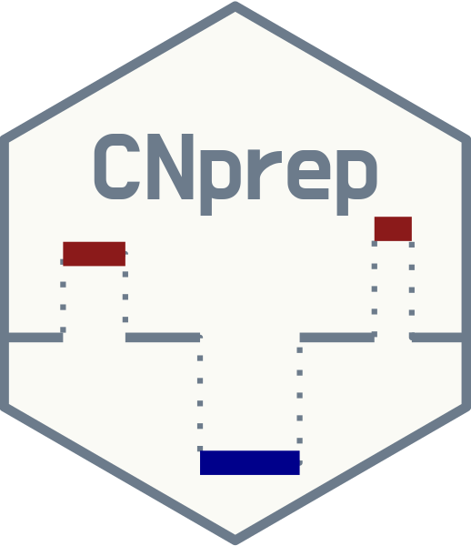

[](https://travis-ci.org/KrasnitzLab/CNprep)
[](https://codecov.io/gh/KrasnitzLab/CNprep)
[](https://www.gnu.org/licenses/old-licenses/gpl-2.0.en.html)

# CNprep <a href='https://github.com/KrasnitzLab/CNprep'></a>

A R package that evaluates DNA copy number data, using both their initial form (copy number as a noisy function of genomic position) and their approximation by a piecewise-constant function (segmentation), for the purpose of identifying genomic regions where the copy number differs from the normal state.


## Citing ##

If you use this package for a publication, we would ask you to cite the 
following:

> Belleau P, Deschênes A, Sun G et al. CNprep: Copy number event detection [version 1; not peer reviewed]. F1000Research 2020, 9:743 (poster) (https://doi.org/10.7490/f1000research.1118065.1)


## Authors ##

Guoli Sun, [Pascal Belleau](http://ca.linkedin.com/in/pascalbelleau "Pascal Belleau"), [Astrid Deschênes](http://ca.linkedin.com/in/astriddeschenes "Astrid Deschênes") and Alexander Krasnitz


## Installation ##

```r
## To install the development version from GitHub
install.packages("devtools")
devtools::install_github("KrasnitzLab/CNprep")
```

## License ##

This package and the underlying *CNprep* code are distributed under 
the GPL-2. You are free to use and redistribute this software. 

For more information on GPL-2 License see
[https://www.gnu.org/licenses/old-licenses/gpl-2.0.txt](https://www.gnu.org/licenses/old-licenses/gpl-2.0.txt)


## Bugs/Feature requests ##

If you have any bugs or feature requests, 
[let us know](https://github.com/KrasnitzLab/CNprep/issues). 

Thanks!