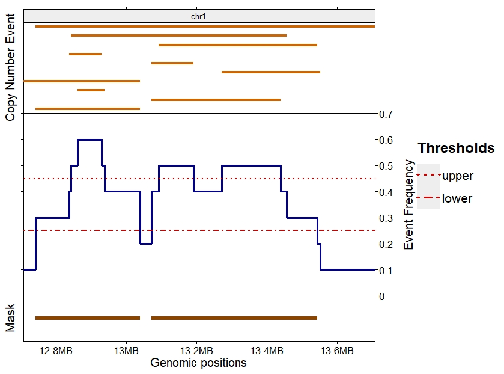
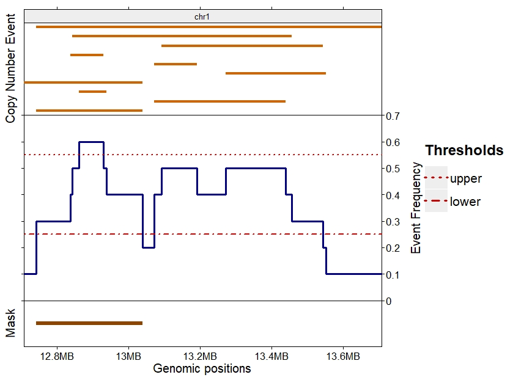

---
title: "Copy Number Event Detection with CNprep"
author: "Guoli Sun, Pascal Belleau, Astrid Deschênes et Alex Krasnitz"
date: "`r Sys.Date()`"
bibliography: CNprep_biblio.bibtex
output: 
    BiocStyle::html_document:
        toc: true
vignette: >
  %\VignetteIndexEntry{CNprep}
  %\VignettePackage{CNprep}
  %\VignetteEngine{knitr::rmarkdown}
  \usepackage[utf8]{inputenc}
---  

```{r setup, include=FALSE}
knitr::opts_chunk$set(echo = TRUE)
```

<br>
**Package**: `r packageDescription("CNprep")[["Package"]]`<br />
**Authors**: `r packageDescription("CNprep")[["Author"]]`<br />
**Version**: `r packageDescription("CNprep")$Version`<br />
**Compiled date**: `r Sys.Date()`<br />
**License**: `r packageDescription("CNprep")[["License"]]`<br />

# License

The *CNprep* package and the underlying *CNprep* code 
are distributed under the 
[GPL-2 License](https://www.gnu.org/licenses/old-licenses/gpl-2.0.txt). You 
are free to use and redistribute this software. 

# Citing

If you use this package for a publication, we ask you to cite the 
following:

> Belleau P, Deschênes A, Sun G et al. CNprep: Copy number event detection [version 1; not peer reviewed]. F1000Research 2020, 9:743 (poster) (https://doi.org/10.7490/f1000research.1118065.1)


# Introduction

The `r Rpackage("CNprep")` package has been implemented to identify, through a 
multi-step process, segments with significant copy number deviation from 
normal state. To this end, 
`r Rpackage("CNprep")` uses both DNA copy number initial form (copy number 
as a noisy function of genomic position, also known as bins) and their 
approximation by a piecewise-constant function (segmentation).

Copy number variations (CNVs) are associated with a wide spectrum of 
pathological conditions and complex traits, such 
as Tourette Disorder [@Wang2018] and especially 
cancer [@Pelttari2018; @Franch-Exposito2018a]. Furthermore, CNVs can 
potentially be used as biomarkers for cancer 
diagnosis [@Pan2018].

Since late 1990s, one commonly used technology to detect CNVs is 
the Comparative Genomic Hybridization (CGH) microarray [@Carter]. From those 
microarrays, software such as *DNACopy* [@Seshan] can identify regions of 
gained and lost copy number.
However, because of the low resolution of the array, detection of short 
CNVs is limited [@Duan].
The availability and low cost of Next-Generation Sequencing (NGS)
have enabled precise detection of CNVs for the entire genome with 
the exclusion of few hard to map regions. This lead to the 
development of software adapted to 
whole-genome and whole-exome sequencing, such as *CNVkit* [@Talevich] and 
*exomecopy* [@Love]. 

In the analysis of bulk tumor DNA cells, not all cells share the same
ploidy or harbor the same copy number alterations. Hence, segments
identified may not share integer copy number. So, evaluating the value of 
the copy number corresponding to the normal state of the cells, relative to 
which somatic alterations occur, is difficult [@Kendall2011].

The `r Rpackage("CNprep")` package has been implemented to identify, 

TODO


# Installing and loading *CNprep* package

The *CNprep* package can be installed from github website using 
*devtools* package:

```{r install, echo=TRUE, message=FALSE, warning=FALSE, eval=FALSE}
library(devtools)
devtools::install_github("belleau/CNprep")
```

As with any R package, the `r Rpackage("CNprep")` package has to be loaded 
with the following command:

```{r loadingPackage, warning=FALSE, message=FALSE}
library(CNprep)
```


# Processing copy number

## Processing copy number for bulk tumor

## Processing copy number for bulk tumor when cancer-free tissues available


# Create and apply a mask to copy number events

In the *CNprep* package, the *makeCNPmask()* and *applyCNPmask()* functions
are complementary methods. 

The *makeCNPmask()* enables the identification
of genomic regions of interest. Those regions can be of interest because those
are regions are not specific to the analyzed condition(s), as an example,
common copy number alterations that are not related to cancer should be 
removed when alterations happening in cancer tissues is of interest. Those 
regions can also be of interest because of their high recurrence in a specific
cohort.

The *applyCNPmask()* function removes the regions identified by
the *makeCNPmask()* function from the dataset.

## Remove non-somatic copy number events when matching normal profile is available

Copy number alterations are not always specific to tumor tissues. Some 
alterations can also be present in the cancer-free tissues, those
are called inherited alterations. Yet,
somatic copy number alterations, specific to cancer, are often
the events of interest. 

In the *CNprep* package, the *makeCNPmask()* function has been implemented
to identify all inherited alterations. This function requires the copy number 
profile of a matching normal tissue.

TODO explain how to


## Remove non-somatic copy number events when matching normal profile is not available but multiple cancer-free profiles are available

When matching cancer-free profile is not available, the identification of 
inherited alterations is based on the population-wide inherited copy number 
data. To be able to do so, a cohort of cancer-free profiles is needed.


TODO explain how to


## Identify recurrent copy number events in a cohort

When multiple bulk cancer tissues DNA profiles are available, the 
*makeCNPmask()* function can be used to identify the recurrent copy number.

The *makeCNPmask()* function takes as inputs: 

1. a table of copy number events with genomic positions for all the profiles
2. an upper threshold
3. a lower threshold

As a first step, interval 
regions where the event count is above the lower threshold are identified. 
Among those retained regions, the function only returns the interval regions 
that contain at least one sub-interval with the count above 
the upper threshold.

Hence, the final mask is a set of genomic intervals that passed both 
thresholds.

As an example, a mask in created from copy number events detected in 10 
cancer samples. In Figure \@ref(fig:demoMask), the top section represent
all copy number events detected in the 10 samples for a small region of 
chromosome 1.
The middle section shows the frequency of the events with the lower and upper
thresholds selected for this analysis. The bottom section displays the result 
of the *makeCNPmask()* function for this dataset when the lower threshold is 
set to 0.25 and upper threshold to 0.45.

```{r demoMask, echo=FALSE, message=FALSE, warning=FALSE, fig.align='center', fig.cap="Example of makeCNPmask() function. Copy number events detected in 10 samples in top section. Frequency of the events with the selected lower and upper thresholds in the middle section. Result of the makeCNPmask() function for those thresholds in the bottom section."}
# library(GenomicRanges)
# library(gtrellis)
# library(ComplexHeatmap)
#
# dataTest <- data.frame(chrom=rep("chr1", 10),
#                 start=c(12742927, 13071912, 12862827, 12708592, 13271912,
#                         13071612, 12838592, 13091712, 12842827, 12742827),
#                 end=c(13039275, 13439275, 12939275, 13039175, 13551912,
#                         13191012, 12930000, 13542827, 13456522, 13706522),
#                 value=seq(from=0.05, to=0.95, by=.1))
# 
# gr <- GRanges(seqnames = Rle(c("chr1"), c(10)),
#     ranges = IRanges(start = dataTest$start, end = dataTest$end,
#                         names = head(letters, 10)),
#     strand = Rle(strand(c("*")), c(10)))
# 
# covN <- as.data.frame(GRanges(coverage(gr)))[-1,]
# covN2 <- covN
# covN2$start <- covN2$end
# covN$end <-covN$start
# covNT <- rbind(covN, covN2)
# covNT <- covNT[order(covNT$start),]
# covNT$freq <- covNT$score/10
# 
# ## Create legend for the upper and lower thresholds
# lgd <- Legend(at=c("upper", "lower"), title="Thresholds", type="lines",
#             legend_gp=gpar(col=rep("red3", 2), lwd=rep(3,2), lty=3:4),
#             gap=unit(10, "mm"), title_gap=unit(5, "mm"),
#             grid_width=unit(10, "mm"), size=unit(4, "mm"),
#             grid_height=unit(10, "mm"),
#             title_gp=gpar(fontsize=18, fontface="bold"),
#             labels_gp=gpar(fontsize=16))
#
# ## Create trellis 
# gtrellis_layout(data=dataTest, n_track=3, 
#                 track_ylim=c(0, 1, 0, 0.70, 0, 1), add_name_track=TRUE,
#                 track_height = unit.c(unit(2, "null"), unit(4, "null"), 
#                                         unit(1, "null")), gap=unit(2, "mm"),
#                 axis_label_fontsize=13, lab_fontsize=15, legend_side="right",
#                 track_axis=c(FALSE, TRUE, FALSE),  legend=lgd,
#                 track_ylab=c("Copy Number Event", "Event Frequency", "Mask"))
# 
# ## Add segments representing the copy number events
# add_segments_track(dataTest, value=dataTest$value, gp=gpar(col="darkorange3", 
#                                                             lwd=4))
# 
# ## Adding the frequency (nb events/nb samples)
# add_lines_track(covNT, value=covNT$freq, gp=gpar(lwd=3, col="darkblue"))
# 
#
## Create data.frame with the current limit of the segments to be used
## to create the threshold lines
# chr1Limits <- data.frame(chrom=rep("chr1", 1), start=c(12708592, 13706522),
#                         end=c(12708592, 13706522))
#
# ## Adding lower threshold
# add_lines_track(chr1Limits, value=0.25, gp=gpar(col="red3", lty=4, lwd=2), 
#                     track=current_track())
# 
# ## Adding upper threshold
# add_lines_track(chr1Limits, value=0.45, gp=gpar(col="red3", lty=3, lwd=2), 
#                     track=current_track())
# 
# ## Get the mask for the current segment dataset
# ## Chromosome must be transform into numbers
# dataTest2 <- dataTest
# dataTest2$chrom <- rep(1, 10)
# 
# mask <- makeCNPmask(imat=dataTest2, chromCol="chrom", startCol="start", 
#                         endCol="end", nProf=10, uThresh=0.45, dThresh=0.25)
# mask <- as.data.frame(mask)
# mask$chrom <- rep("chr1", nrow(mask))
# 
# ## Add segments representing the copy number events
# add_segments_track(mask, value=0.5, gp=gpar(col="darkorange4", lwd=6))



```


Using an upper threshold of 0.55 on the same copy number events results in 
only one genomic region in the mask, as shown in 
Figure \@ref(fig:demoMask2). This region is the only one to respect both 
lower and upper thresholds. 

```{r demoMask2, echo=FALSE, message=FALSE, warning=FALSE, fig.align='center', fig.cap="Example of makeCNPmask() function with stringent parameters. Copy number events detected in 10 samples in top section. Frequency of the events with the selected lower and upper thresholds in the middle section. Result of the makeCNPmask() function for those thresholds in the bottom section."}

# library(GenomicRanges)
# library(gtrellis)
# library(ComplexHeatmap)
# 
# dataTest <- data.frame(chrom=rep("chr1", 10),
#                 start=c(12742927, 13071912, 12862827, 12708592, 13271912,
#                         13071612, 12838592, 13091712, 12842827, 12742827),
#                 end=c(13039275, 13439275, 12939275, 13039175, 13551912,
#                         13191012, 12930000, 13542827, 13456522, 13706522),
#                 value=seq(from=0.05, to=0.95, by=.1))
# 
# gr <- GRanges(seqnames = Rle(c("chr1"), c(10)),
#     ranges = IRanges(start = dataTest$start, end = dataTest$end,
#                         names = head(letters, 10)),
#     strand = Rle(strand(c("*")), c(10)))
# 
# covN <- as.data.frame(GRanges(coverage(gr)))[-1,]
# covN2 <- covN
# covN2$start <- covN2$end
# covN$end <-covN$start
# covNT <- rbind(covN, covN2)
# covNT <- covNT[order(covNT$start),]
# covNT$freq <- covNT$score/10
# 
# ## Create legend for the upper and lower thresholds
# lgd <- Legend(at=c("upper", "lower"), title="Thresholds", type="lines",
#             legend_gp=gpar(col=rep("red3", 2), lwd=rep(3,2), lty=3:4),
#             gap=unit(10, "mm"), title_gap=unit(5, "mm"),
#             grid_width=unit(10, "mm"), size=unit(4, "mm"),
#             grid_height=unit(10, "mm"),
#             title_gp=gpar(fontsize=13, fontface="bold"),
#             labels_gp=gpar(fontsize=12))
# 
# # Create data.frame with the current limit of the segments to be used
# # to create the threshold lines
# chr1Limits <- data.frame(chrom=rep("chr1", 1), start=c(12708592, 13706522),
#                         end=c(12708592, 13706522))
# 
# jpeg(file = paste0("mask_test_v02.jpeg"), width = 5.8, height = 3.7, units="in", res = 300)
# 
# 
# ## Create trellis
# gtrellis_layout(data=dataTest, n_track=3,
#                 track_ylim=c(0, 1, 0, 0.70, 0, 1), add_name_track=TRUE,
#                 track_height = unit.c(unit(2, "null"), unit(4, "null"),
#                                         unit(1, "null")), gap=unit(2, "mm"),
#                 axis_label_fontsize=12, lab_fontsize=12, legend_side="right",
#                 track_axis=c(FALSE, TRUE, FALSE),  legend=lgd, xlab = "Genomic Positions",
#                 track_ylab=c("Copy Number Event", "Event Frequency", "Mask"))
# 
# ## Add segments representing the copy number events
# add_segments_track(gr, value=dataTest$value, gp=gpar(col="darkorange3",
#                                                             lwd=4))
# 
# ## Adding the frequency (nb events/nb samples)
# add_lines_track(covNT, value=covNT$freq, gp=gpar(lwd=3, col="darkblue"))
# 
# ## Adding lower threshold
# add_lines_track(chr1Limits, value=0.25, gp=gpar(col="red3", lty=4, lwd=2),
#                     track=current_track())
# 
# ## Adding upper threshold
# add_lines_track(chr1Limits, value=0.55, gp=gpar(col="red3", lty=3, lwd=2),
#                     track=current_track())
# 
# ## Get the mask for the current segment dataset
# ## Chromosome must be transform into numbers
# dataTest2 <- as.data.frame(gr)
# dataTest2$chrom <- rep(1, 10)
# 
# mask <- makeCNPmask(imat=dataTest2, chromCol="chrom", startCol="start",
#                         endCol="end", nProf=10, uThresh=0.55, dThresh=0.25)
# mask <- as.data.frame(mask)
# mask$chrom <- rep("chr1", nrow(mask))
# 
# ## Add segments representing the copy number events
# add_segments_track(mask, value=0.5, gp=gpar(col="darkorange4", lwd=6))
# 
# dev.off()


```


The following section demonstrates the usage of *makeCNPmask()* on a more
complex dataset composed of 1203 breast cancer samples.

```{r makeMask, echo=TRUE, warning=FALSE, collapse=TRUE, fig.align='center', fig.cap="Example of makeCNPmask() on a dataset of 1203 samples. The amplification events are shown, in blue, in the top section. Results of the makeCNPmask() are shown for four chromosomes, in red, in the bottom section. In this example, only chromosome 7 doesn't have any mask."}
## Needed libraries
library(GenomicRanges)
library(gtrellis)

## Load example containing the copy number events for 1203 samples
data(cnpexample)

## Retaining only the amplification events
ampCNP <- subset(cnpexample, copy.num == "amp")

## The amplification table has 4 columns:
##     copy.num identifies the type of event
##     chrom is the number identifying the chromosome
##     chrom.start is the starting position of the event
##     chrom.end is the ending position of the event
head(ampCNP, n=3)

## Create a mask using the amplification events.
## The name of the columns for the chromosome identification 
## (chromCol parameter), the starting and ending positions 
## (startCol and endCol parameters) must be given.
## The number of samples (nProf parameter) is also needed.
ampCNPmask <- makeCNPmask(imat=ampCNP, chromCol="chrom", 
    startCol="chrom.start", endCol="chrom.end", nProf=1203, 
    uThresh=0.2, dThresh=0.01)

## Transfrom the mask segments into Genomic Ranges
grAmpCNP <- GRanges(seqnames = Rle(paste0("chr", ampCNP$chrom)),
    ranges = IRanges(start = ampCNP$chrom.start, end = ampCNP$chrom.end + 1),
    strand = Rle(strand(c("*")), nrow(ampCNP)))

## Create trellis graph
gtrellis_layout(species = "hg19", category=paste0("chr", c(1,7,9,15)), 
    n_track=3, nrow=2, track_height=unit.c(2*grobHeight(textGrob("chr1")), 
    unit(10, "null"), unit(2, "null")))

## Add track for chromosome names
add_track(panel_fun = function(gr) {
    chr <- get_cell_meta_data("name")  
    grid.rect(gp=gpar(fill="#EEEEEE"))
    grid.text(chr) })

## Add segments representing the copy number events
add_segments_track(grAmpCNP, value=runif(length(grAmpCNP)), 
    gp=gpar(col="blue", lwd=4))

## Add segments representing the masks
maskFinal <- as.data.frame(ampCNPmask)
maskFinal$chrom <- paste0("chr", as.character(maskFinal$chrom))
add_rect_track(maskFinal, h1=0, h2=1, gp=gpar(col="red2", fill="red2"))
```


## Apply mask to a table of copy number events

The *applyCNPmask()* function ... TODO


# Using parallelization

For experiments with many samples, one can take advantage of parallelized 
computation. Parallelizing *CNpreprocessing()* function can easily be 
accomplished by setting the *nJobs* parameter to a number higher than 
one. Beware that the parallelization is done per sample. So, the *nJobs 
should not be higher than the number of samples in the dataset.

```{r parallel, echo=TRUE, eval=FALSE}

## Load needed datasets
data(segexample)
data(ratexample)
data(normsegs)

## The number of threads is set to 4 (nJobs parameter)
## Only the chromosomes 1 to 6 are analyzed (chromRange parameter)
segtable <- CNpreprocessing(segall=segexample, ratall=ratexample, 
    idCol="ID", startCol="start", endCol="end", chromCol="chrom", 
    bpStartCol="chrom.pos.start", bpEndCol="chrom.pos.end", blsize=50,
    minJoin=0.25, cWeight=0.4, bsTimes=50, chromRange=1:6, nJobs=4,
    normalLength=normsegs[,1], normalMedian=normsegs[,2])

```


# Reproducible research

To ensure reproducible results, *set.seed()* function should be call 
before *CNpreprocessing()*. Beware that the *nJobs* parameter must 
also be fixed. Change in the value of the *nJobs* parameter will 
lead to different results.


# Session info

Here is the output of *sessionInfo()* on the system on which this document 
was compiled:

```{r sessionInfo, echo=FALSE}
sessionInfo()
```

# References